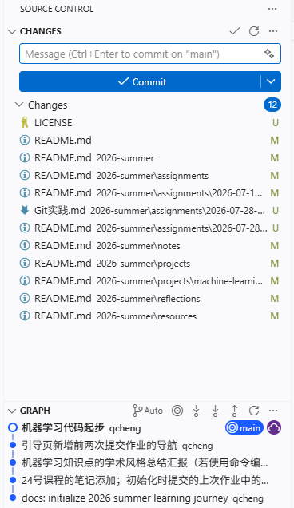
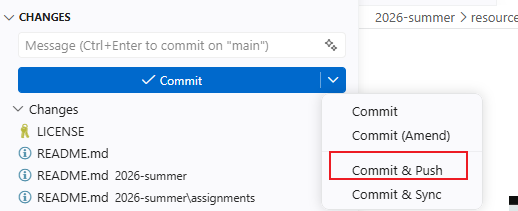
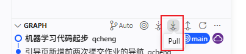
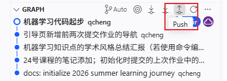

# VsCode的Git使用

## 整体UI

## 提交并推送

## 拉取

## 推送远端

# 命令行使用
在不使用集成了Git的IDE时，可通过命令行的方式进行仓库的初始化、拉取、提交、推送、切换分支等一系列操作，下面以初始化仓库为例
## 建立仓库
在github的web端建立好自己的仓库后，根据引导创建本地仓库
> echo "# test" >> README.md  
> git init  
> git add README.md  
> git commit -m "first commit"  
> git branch -M main  
> git remote add origin https://github.com/your_name/repository_name.git  
> git push -u origin main  

若已有本地仓库但是未连接远端的话
> git remote add origin https://github.com/your_name/repository_name.git  
> git branch -M main  
> git push -u origin main  

通过上述命令可以初步的建立起本地和远端仓库的链接
> 💡注意：以上的示例链接中 将 **your_name** 换成真实用户名；**repository_name**换成真实项目（仓库）名