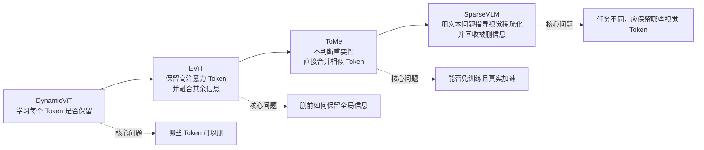
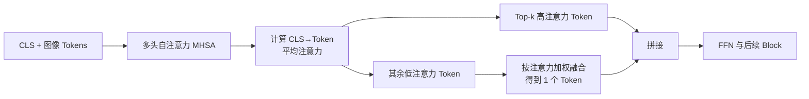
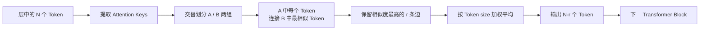
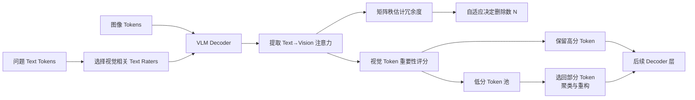
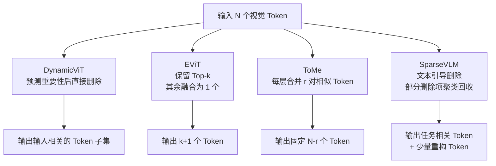
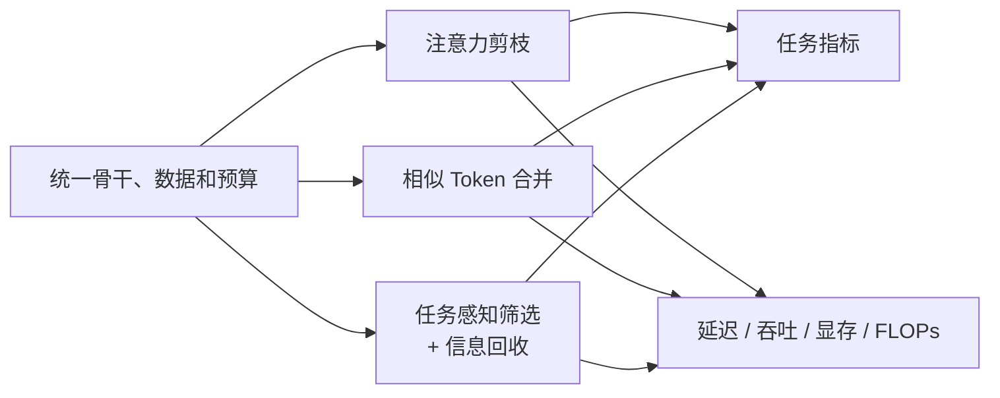

# 视觉 Token 筛选与压缩：四篇代表性论文五段式总结

> 覆盖论文：DynamicViT、EViT、ToMe、SparseVLM  
> 研究主线：动态剪枝 → 信息融合 → 相似性合并 → 多模态任务感知稀疏化  
> 面向方向：视觉与多模态模型的系统性能优化  
> 整理日期：2026-08-15

---

## 0. 阅读说明

本文统一按以下“五段式”分析每篇论文：

1. **研究背景与核心问题**：作者为什么要做这项工作？
2. **核心思想与主要贡献**：论文最重要的新意是什么？
3. **方法设计与实现机制**：Token 如何选择、删除、融合或回收？
4. **实验设置与关键结果**：性能、计算量和真实速度有什么变化？
5. **局限性与个人思考**：方法还存在哪些问题？可以怎样继续研究？

文中的流程图均为依据论文内容绘制的**概念示意图**，并非直接截取论文图片。实验数字来自论文公开结果，不同论文使用的模型、硬件和测量口径不同，不能直接横向比较绝对速度。

### 0.1 四篇论文的演进关系

### 0.2 一张表看懂四篇论文

| 论文 | 会议 | Token 操作 | 选择依据 | 是否需要训练 | 信息保留方式 | 最适合的场景 |
|---|---|---|---|---|---|---|
| DynamicViT | NeurIPS 2021 | 动态剪枝 | 轻量预测器综合局部与全局特征 | 需要训练/微调 | 教师蒸馏约束 | 图像分类中的输入自适应加速 |
| EViT | ICLR 2022 Spotlight | 保留 + 融合 | `[CLS]` 对图像 Token 的注意力 | 需要随模型训练 | 低注意力 Token 加权融合成 1 个 Token | 结构简单、易插入的 ViT 加速 |
| ToMe | ICLR 2023 Oral / Top 5% | 相似 Token 合并 | Attention Key 的余弦相似度 | 可免训练，也可随模型训练 | 按 Token 尺寸加权平均 | 现成 ViT 的低成本、通用加速 |
| SparseVLM | ICML 2025 | 文本引导剪枝 + 回收 | 文本-视觉注意力、矩阵秩 | 免训练 | 聚类并重构部分被剪 Token | 视觉语言模型的任务感知推理加速 |

---

# 1. DynamicViT

**论文全名：** *DynamicViT: Efficient Vision Transformers with Dynamic Token Sparsification*  
**作者：** Yongming Rao 等  
**出处：** NeurIPS 2021  
**论文：** [NeurIPS Proceedings](https://proceedings.neurips.cc/paper/2021/hash/747d3443e319a22747fbb873e8b2f9f2-Abstract.html) · [arXiv:2106.02034](https://arxiv.org/abs/2106.02034)  
**代码：** [raoyongming/DynamicViT](https://github.com/raoyongming/DynamicViT)

## 第一段：研究背景与核心问题

ViT 把图像切分成大量 Patch Token，并在每一层对所有 Token 进行自注意力和前馈计算。但是，对最终分类真正重要的通常只是部分前景区域，大量背景 Token 的贡献很小。

CNN 可以通过结构化下采样逐步压缩空间分辨率，而 Transformer 能接受可变长度序列，因此可以针对**每一张输入图像**动态删除不重要的 Token。论文要解决的问题是：

> 能否让 ViT 根据当前输入，逐层判断哪些 Token 已经没有必要继续计算，并在准确率基本不变的前提下获得真实推理加速？

## 第二段：核心思想与主要贡献

DynamicViT 的核心是**输入自适应、逐层进行的 Token 稀疏化**：

- 在多个 Transformer 层之间加入轻量 Token 预测模块；
- 每个预测模块为当前仍存活的 Token 估计“保留/删除”概率；
- 随网络加深逐渐删除 Token，一旦删除便不再参与后续推理；
- 训练时使用 Gumbel-Softmax 和 Attention Masking 解决离散决策不可导、不同样本 Token 数不同的问题；
- 使用教师模型蒸馏和 Token 比例约束，降低剪枝造成的性能损失。

它的关键贡献不是静态地删除固定位置，而是让**不同图像产生不同的空间稀疏模式**。

## 第三段：方法设计与实现机制

### 3.1 Token 预测器

对第 $i$ 个 Token，预测器同时使用：

- **局部特征**：当前 Token 自身表达什么；
- **全局特征**：所有存活 Token 的聚合信息，表示整幅图像的上下文。

二者拼接后经 MLP 和 Softmax，得到删除与保留概率：

$$
\pi_i = \operatorname{Softmax}\left(\operatorname{MLP}
\left([z_i^{\text{local}},z^{\text{global}}]\right)\right).
$$

该设计说明 Token 是否重要不能只看自身，还要看它相对于整张图像是否提供了独特信息。

### 3.2 可微分 Token 决策

“保留/删除”是二值决策，普通采样无法直接反向传播。作者使用 Gumbel-Softmax 生成近似可导的二值掩码。

训练时并不真正改变张量长度，而是使用 **Attention Masking** 阻断已删除 Token 对其他 Token 的影响；推理时再真正移除低分 Token，从而减少计算量。

### 3.3 训练目标

总损失由四部分组成：

$$
\mathcal{L}=\mathcal{L}_{cls}
+\lambda_{KL}\mathcal{L}_{KL}
+\lambda_{distill}\mathcal{L}_{distill}
+\lambda_{ratio}\mathcal{L}_{ratio}.
$$

- $\mathcal{L}_{cls}$：分类损失；
- $\mathcal{L}_{KL}$：学生模型与原模型输出分布保持一致；
- $\mathcal{L}_{distill}$：剩余 Token 特征接近教师模型；
- $\mathcal{L}_{ratio}$：约束各阶段实际保留率接近预设值。

论文在 12 层模型中通常把稀疏化位置放在第 4、7、10 个 Block 之前，并使用 $[\rho,\rho^2,\rho^3]$ 的逐层保留率。

## 第四段：实验设置与关键结果

论文主要在 ImageNet-1K 上验证 DeiT-S、LV-ViT-S 和 LV-ViT-M。吞吐量在单张 RTX 3090、batch size 32 下测量。

### 4.1 代表性结果

| 模型 | 每阶段保留率 | Top-1 | GFLOPs | 吞吐量（images/s） |
|---|---:|---:|---:|---:|
| DeiT-S 基线 | 1.0 | 79.8 | 4.6 | 1337.7 |
| DynamicViT-DeiT-S | 0.7 | 79.3（-0.5） | 2.9（-37%） | 2062.1（+54%） |
| LV-ViT-S 基线 | 1.0 | 83.3 | 6.6 | 993.3 |
| DynamicViT-LV-S | 0.7 | 83.0（-0.3） | 4.6（-31%） | 1417.6（+43%） |
| LV-ViT-M 基线 | 1.0 | 84.0 | 12.7 | 589.5 |
| DynamicViT-LV-M | 0.7 | 83.8（-0.2） | 8.5（-33%） | 888.2（+50%） |

每阶段保留率为 0.7 时，经过三次筛选最终约保留 $0.7^3=34.3\%$ 的初始 Token，即累计删除约 66%。论文整体结论是：减少约 31%-37% FLOPs、吞吐提升超过 40%，准确率下降控制在 0.5 个百分点以内。

## 第五段：局限性与个人思考

### 局限性

1. **需要训练预测器并微调骨干**，不是直接应用到现成模型的免训练方案。
2. 训练阶段用 Mask 保持统一张量形状，因此主要节省发生在推理阶段。
3. Token 一旦删除就无法恢复，早期误删可能造成不可逆的信息损失。
4. 论文重点验证图像分类；对小目标、密集预测、OCR、异常边界等细粒度任务，低响应 Token 可能仍很关键。

### 我的思考

DynamicViT 真正值得借鉴的是“**每个输入的计算路径应该不同**”。但预测器的目标仍主要围绕分类正确性，下一步可以研究：

- 把任务不确定性、目标尺寸、局部纹理等信号加入 Token 评分；
- 不立即永久删除低分 Token，而是保留压缩摘要或允许后续层重新激活；
- 在相同 FLOPs 预算下比较动态选择与静态选择，而不是只比较剪枝率。

---

# 2. EViT

**论文全名：** *Not All Patches Are What You Need: Expediting Vision Transformers via Token Reorganizations*  
**作者：** Youwei Liang 等  
**出处：** ICLR 2022 Spotlight  
**论文：** [ICLR 页面](https://iclr.cc/virtual/2022/spotlight/6169) · [arXiv:2202.07800](https://arxiv.org/abs/2202.07800)  
**代码：** [youweiliang/evit](https://github.com/youweiliang/evit)

## 第一段：研究背景与核心问题

直接删除低注意力 Token 虽然可以降低计算量，却会明显损害准确率。原因是低注意力不等于完全无信息：背景、上下文和被部分遮挡的目标仍可能影响判断。

EViT 要解决的问题是：

> 能否不增加额外参数，利用 ViT 已经计算出的 `[CLS]` 注意力识别重要 Token，同时把非重要 Token 的信息压缩保留下来？

## 第二段：核心思想与主要贡献

EViT 提出 **Token Reorganization（Token 重组）**：

- 用多头注意力中 `[CLS]` 指向各图像 Token 的平均权重衡量重要性；
- 保留注意力最高的 Top-k Token；
- 不把其余 Token 完全丢掉，而是加权融合为一个代表 Token；
- 将重组模块放在 MHSA 与 FFN 之间，使后续注意力和前馈网络都处理更短的序列；
- 不引入额外可学习参数。

它相对纯剪枝的重要改进是：**把“删掉”变成“保留重点 + 压缩非重点”。**

## 第三段：方法设计与实现机制

### 3.1 重要 Token 识别

多头注意力中，第一个查询对应 `[CLS]`。作者对所有头的 `[CLS]→Token` 注意力取平均，并选择最大的 Top-k 个：

$$
\bar{a}=\frac{1}{H}\sum_{h=1}^{H}a^{(h)}, \qquad
\mathcal{T}=\operatorname{TopK}(\bar{a},k).
$$

保留率定义为 $\kappa=k/n$，其中 $n$ 是当前图像 Token 数。

### 3.2 非重要 Token 融合

设低注意力 Token 的索引集合为 $\mathcal{N}$，它们被融合为：

$$
x_{fused}=\sum_{i\in\mathcal{N}}a_i x_i.
$$

随后将 $x_{fused}$ 与 Top-k Token 一起送入后续层。这样只增加一个聚合 Token，却保留了被压缩区域的总体信息和梯度通路。

### 3.3 插入位置与训练

对 12 层 DeiT，论文默认在第 4、7、10 层进行 Token 重组。训练初期保留率从 1 通过余弦策略逐步降到目标值，避免训练刚开始时突然删除大量 Token。

## 第四段：实验设置与关键结果

论文在 ImageNet-1K 上训练，默认输入为 224×224；吞吐量在单张 NVIDIA A100、batch size 128 下测量，因此其绝对吞吐量不能与 DynamicViT 的 RTX 3090 结果直接比较。

### 4.1 DeiT-S 代表性结果

| 方法 | 保留率 | Top-1 | MACs（G） | 吞吐量（images/s） |
|---|---:|---:|---:|---:|
| DeiT-S 基线 | 1.0 | 79.8 | 4.6 | 2923 |
| EViT + 融合 | 0.9 | 79.8（±0.0） | 4.0（-13%） | 3197（+9%） |
| EViT + 融合 | 0.8 | 79.8（±0.0） | 3.5（-24%） | 3619（+24%） |
| EViT + 融合 | 0.7 | 79.5（-0.3） | 3.0（-35%） | 4385（+50%） |
| EViT + 融合 | 0.5 | 78.5（-1.3） | 2.3（-50%） | 5408（+85%） |

论文还给出另一种使用方式：在计算量与原始 DeiT-S 接近时，把输入分辨率提高，使 Top-1 约提升 1 个百分点。也就是说，节省的计算量既可以换成速度，也可以重新投入更高分辨率以换取性能。

## 第五段：局限性与个人思考

### 局限性

1. `[CLS]` 注意力天然服务于图像级分类，不一定适合检测、分割和多模态问答。
2. 固定 Top-k 保留率不区分简单图像与复杂图像，计算分配仍不完全动态。
3. 所有低注意力 Token 被压成一个 Token，可能混合互不相关的区域。
4. 需要在训练阶段加入 Token 重组，不能完全无成本地部署到任意现成模型。

### 我的思考

EViT 说明“低重要性信息不应该简单归零”，这与我后续想研究的**信息回收**直接相关。可以进一步尝试：

- 将低分 Token 按空间邻域或语义相似度分成多个组，而不是全部融合成一个；
- 将 `[CLS]` 注意力换成与具体任务相关的信号，如文本查询、检测 Query 或局部不确定性；
- 自适应决定每层保留率，同时限制同一批次内的长度差异，兼顾精度与真实硬件效率。

---

# 3. ToMe

**论文全名：** *Token Merging: Your ViT but Faster*  
**作者：** Daniel Bolya 等  
**出处：** ICLR 2023 Oral / Top 5%  
**论文：** [ICLR 页面](https://iclr.cc/virtual/2023/oral/12533) · [arXiv:2210.09461](https://arxiv.org/abs/2210.09461)  
**代码：** [facebookresearch/ToMe](https://github.com/facebookresearch/ToMe)

## 第一段：研究背景与核心问题

Token 剪枝的主要缺陷是信息不可逆丢失，而且多数方法需要重新训练或额外预测器。动态剪枝还会让同一 batch 中不同样本的序列长度不同，可能需要 Padding，导致理论 FLOPs 下降却未必获得同等真实加速。

ToMe 改变了问题的问法：

> 与其预测哪些 Token 不重要并删除，能否直接把表达相似内容的 Token 合并，从而在不训练或少改代码的条件下缩短序列？

## 第二段：核心思想与主要贡献

ToMe 的核心是**按相似性逐层合并 Token，而非按重要性剪枝**：

- 每层固定减少 $r$ 个 Token，保证 batch 内序列长度一致；
- 使用自注意力中的 Key 向量衡量 Token 相似性，不增加专用特征提取器；
- 使用并行的二分图软匹配，速度接近直接剪枝；
- 用 Token size 记录一个合并 Token 代表了多少原始 Patch；
- 可以直接作用于预训练模型，也能在训练阶段使用并获得训练加速；
- 同一机制可用于图像、视频和音频 Transformer。

## 第三段：方法设计与实现机制

### 3.1 为什么使用 Key 相似度

原始中间特征维度高且可能含噪声，而 Attention Key 已经是模型为了相似度匹配而学习出的表达。论文使用各 Token 的 Key 向量，经归一化后计算余弦相似度。

### 3.2 Bipartite Soft Matching

算法步骤为：

1. 把 Token 交替分到近似等大的集合 A 与 B；
2. A 中每个 Token 只连接到 B 中最相似的 Token；
3. 选择相似度最高的 $r$ 条边；
4. 将仍相连的 Token 加权合并；
5. 把未合并 Token 与合并结果重新拼接。

它没有迭代聚类过程，适合 GPU 并行执行。每层固定减少 $r$ 个 Token，经过 $L$ 层总共最多减少 $r^L$ 个。

### 3.3 Proportional Attention

合并后的 Token 可能代表多个原始 Patch。设其 size 为 $s$，ToMe 在注意力 Logit 中加入 $\log s$：

$$
A=\operatorname{Softmax}\left(\frac{QK^{T}}{\sqrt d}+\log s\right).
$$

这相当于提醒注意力模块：“这个 Token 虽然只占一个位置，但它代表多个原始区域。”Token 合并时也按 size 进行加权平均。

## 第四段：实验设置与关键结果

论文在 ImageNet-1K 上评估 AugReg、MAE、SWAG、DeiT 等多种 ViT，并扩展到视频和音频。图像吞吐量主要在 V100 上测量。

### 4.1 关键结论

| 场景 | 结果 |
|---|---|
| 大型高分辨率图像 ViT，免训练 | ViT-L@512、ViT-H@518 吞吐约 2×，准确率下降约 0.2-0.3 个百分点 |
| 视频 ViT，免训练 | ViT-L 吞吐约 2.2×，准确率下降约 0.2-0.3 个百分点 |
| MAE 视频微调 | 实际训练速度最高约 2× |
| 音频 ViT，随模型训练 | 吞吐约 2×，mAP 下降约 0.4 个百分点 |

### 4.2 设计消融示例

以免训练的 MAE ViT-L/16、ImageNet-1K、$r=8$ 为例：基线为 85.96% Top-1、93.3 images/s；默认 ToMe 为 84.25%、182.9 images/s。该设置接近 2× 吞吐，但精度下降约 1.71 个百分点，说明“2× 加速只下降 0.2-0.3”主要出现在容量更大、输入分辨率更高的模型上，不能不加条件地推广到所有 ViT。

论文还显示，二分图匹配几乎与随机剪枝一样快，但准确率明显更高；相较 k-means，它牺牲极少准确率，却避免了迭代聚类的明显时间开销。

## 第五段：局限性与个人思考

### 局限性

1. ToMe 按**相似性**而非任务重要性合并，两个相似 Token 仍可能包含影响最终任务的细微差异。
2. 每层固定减少 $r$ 个 Token 有利于批处理，但不区分输入难度。
3. 合并是不可逆的；若早期把小目标、文字或缺陷边界融入背景，后续层难以恢复。
4. 加速收益依赖模型规模、深度、输入分辨率和硬件；小模型上的精度-速度权衡可能不如大模型。

### 我的思考

ToMe 对系统性能优化很有价值，因为它把**真实吞吐与批处理友好性**放在重要位置。它提示我：好的算法不能只降低 FLOPs，还必须考虑张量规则性、并行性和算子开销。

但仅使用相似度还不够。可以研究“**任务相关相似性**”：

- 视觉模型中加入类别、目标或不确定性信号；
- 多模态模型中加入文本 Query，使不同问题产生不同合并关系；
- 为小目标/OCR Token 设置保护机制；
- 在固定输出长度下，比较“剪枝”“合并”“剪枝 + 回收”哪种方式保留的信息最多。

---

# 4. SparseVLM

**论文全名：** *SparseVLM: Visual Token Sparsification for Efficient Vision-Language Model Inference*  
**作者：** Yuan Zhang 等  
**出处：** ICML 2025  
**论文：** [PMLR](https://proceedings.mlr.press/v267/zhang25s.html) · [arXiv:2410.04417](https://arxiv.org/abs/2410.04417)  
**代码：** [Gumpest/SparseVLMs](https://github.com/Gumpest/SparseVLMs)

## 第一段：研究背景与核心问题

视觉语言模型会把图像编码成大量视觉 Token。论文举例：LLaVA 中一张 672×672 图像可产生 2304 个视觉 Token，占用超过一半上下文长度。大量视觉 Token 会增加 LLM 自注意力、FFN、KV Cache 和推理延迟。

此前许多方法只看视觉侧统计量，忽略了用户问题。可是同一张图在回答“蓝色标牌写了什么”“有几辆公交车”“屋顶是什么颜色”时，真正重要的区域完全不同。

因此 SparseVLM 研究的问题是：

> 能否在不训练额外网络的情况下，利用文本问题指导视觉 Token 筛选，并把可能有用的被剪信息压缩回收？

## 第二段：核心思想与主要贡献

SparseVLM 是一个**文本引导、逐层自适应、免训练**的视觉 Token 稀疏化框架：

- 先从问题文本中选择真正与图像相关的 Text Raters；
- 利用 LLM 已产生的文本-视觉注意力估计视觉 Token 对问题的重要性；
- 根据注意力优先矩阵的秩估计当前层冗余程度，自适应决定删除数量；
- 从待删除 Token 中选回部分较重要者，聚类并重构为少量紧凑 Token；
- 不增加训练参数，不需要额外数据或微调；
- 同时支持图像和视频理解。

这篇论文把研究问题从“哪些视觉 Token 看起来不重要”，推进为“**相对于当前问题，哪些视觉 Token 不重要**”。

## 第三段：方法设计与实现机制

### 3.1 Text Rater 选择

并非所有问题词都与视觉内容有关，介词、代词和模板词可能干扰评分。SparseVLM 先计算文本 Token 与视觉 Token 的相关性，只让高于平均相关度的文本 Token 成为 Rater。

这一步的直觉是：先判断“问题中的哪些词需要看图”，再让这些词评价“图中的哪些区域值得保留”。

### 3.2 视觉 Token 重要性与自适应稀疏率

论文复用 Decoder 中已有的自注意力矩阵，截取文本查询到视觉 Key 的子矩阵 $P\in\mathbb{R}^{L_t\times L_v}$，对 Rater 维度聚合得到视觉 Token 重要性。

随后使用矩阵秩衡量冗余程度：

$$
N=\lambda\left(L_v-\operatorname{rank}(P)\right),
$$

其中 $L_v$ 为视觉 Token 数，$N$ 为该层删除数量，$\lambda$ 为控制系数。若 $N=0$，该层跳过稀疏化。

### 3.3 Token Recycling

SparseVLM 不直接丢弃全部低分 Token，而是：

1. 从删除池中选择评分较高的前 $\tau\%$ Token；
2. 使用基于 k 近邻密度峰值的算法选择聚类中心；
3. 把相似 Token 分配到同一组；
4. 将每组 Token 求和，重构成一个紧凑 Token；
5. 把重构 Token 送回后续 Decoder 层。

这使“筛选”和“信息保留”成为两个独立控制环节。

## 第四段：实验设置与关键结果

论文在 LLaVA、Mini-Gemini、Qwen2-VL 和 Video-LLaVA 上验证，覆盖 GQA、MMBench、MME、POPE、ScienceQA、SEED、TextVQA、MM-Vet 以及多个视频问答数据集。

### 4.1 SparseLLaVA：576 → 192 Token

| 方法 | 剩余 Token | 八项任务相对平均性能 | FLOPs（T） | 延迟（ms） |
|---|---:|---:|---:|---:|
| Vanilla LLaVA | 576 | 100.0% | 4.62 | 57.82 |
| ToMe | 192 | 88.9% | 2.05 | 34.06 |
| FastV | 192 | 87.9% | 2.11 | 34.87 |
| PDrop | 192 | 95.9% | 2.03 | 36.74 |
| **SparseVLM** | **192** | **99.1%** | **2.14** | **36.50** |

在保留 192/576 Token 时，SparseVLM 相对基线减少约 54% FLOPs、降低约 37% 延迟，同时保留 99.1% 的平均性能。论文还报告该设置下 KV Cache 从 302.4 MB 降到 100.8 MB，减少约 67%。

### 4.2 更高压缩率

| 剩余 Token | SparseVLM 相对平均性能 | FLOPs（T） | 延迟（ms） |
|---:|---:|---:|---:|
| 192（删除 66.7%） | 99.1% | 2.14 | 36.50 |
| 128（删除 77.8%） | 96.7% | 1.72 | 33.28 |
| 64（删除 88.9%） | 89.3% | 1.30 | 29.89 |

结果表明：压缩越激进，绝对性能仍会下降，但 SparseVLM 在相同 Token 数下明显优于不考虑文本问题的 ToMe 和 FastV。

### 4.3 Token Recycling 消融

在 LLaVA-7B 的 POPE 上，重构模块在 64 Token 设置下把准确率从 72.8 提升到 77.5；随着删除池变大，Token Recycling 带来的收益更明显。这为“低分 Token 仍可能包含关键细节”提供了直接实验支持。

## 第五段：局限性与个人思考

### 局限性

1. 依赖注意力作为 Token 重要性代理，但“高注意力”与“真实因果贡献”并不完全等价。
2. 矩阵秩、注意力提取和聚类重构都会产生额外开销；真实收益必须以端到端延迟而非只看 FLOPs。
3. 访问注意力矩阵可能与 FlashAttention 等内核优化存在工程冲突，论文需要专门做兼容处理。
4. Rank、$\lambda$、$\tau$、聚类数量等超参数仍会影响不同模型和数据集的结果。
5. 文本引导适合问答任务，但对无文本提示的纯视觉任务还需要其他任务条件。

### 我的思考

SparseVLM 与我的未来方向最接近，因为它同时处理了三个层面：

- **算法层**：哪些 Token 对当前任务重要；
- **信息层**：被筛掉的内容如何回收；
- **系统层**：FLOPs、CUDA 时间和 KV Cache 是否同时下降。

但仍可继续研究：

- 使用更加可靠的任务贡献估计，减少对单一注意力分数的依赖；
- 对小目标、OCR 和细粒度区域设置安全保护或二次检查；
- 让 Token 预算由输入难度、层深和硬件负载共同决定；
- 设计规则批处理，使不同样本的动态 Token 数仍能高效利用 GPU；
- 在固定延迟或固定显存预算下最大化任务性能，而不是预先固定剪枝比例。

---

# 5. 横向比较：四篇论文到底有什么区别

## 5.1 Token 数量如何变化

## 5.2 关键权衡

| 维度 | DynamicViT | EViT | ToMe | SparseVLM |
|---|---|---|---|---|
| 输入自适应 | 强 | 弱，固定 Top-k | 弱，固定每层合并数 | 强，随文本和层变化 |
| 任务感知 | 分类监督隐式学习 | `[CLS]` 分类注意力 | 基本无，只看相似度 | 文本问题显式引导 |
| 免训练部署 | 否 | 否 | 是 | 是 |
| 信息是否可恢复 | 删除后不可恢复 | 压成一个 Token | 合并保留平均信息 | 选回、聚类并重构 |
| 批处理友好性 | 推理时固定阶段数量较友好 | 较友好 | 很友好 | 需要关注动态长度与算子实现 |
| 主要风险 | 早期误删 | 单一融合 Token 信息拥挤 | 相似但关键差异被抹平 | 注意力代理与额外算子开销 |

## 5.3 不能直接比较绝对速度的原因

四篇论文的硬件和口径不同：

- DynamicViT 的代表吞吐量在 RTX 3090、batch 32 上测量；
- EViT 的代表吞吐量在 A100、batch 128 上测量；
- ToMe 的图像实验主要使用 V100 并选择最优 batch size；
- SparseVLM 的效率实验使用 A100-80GB，报告 LLaVA 的单图推理延迟、FLOPs 和 Cache。

因此，正确的比较方式是看每篇论文中**相对于其自身基线的变化**，并在自己的复现实验中统一硬件、输入、batch、精度格式、预热和计时方法。

---

# 6. 我的统一理解：问题不是“删多少”，而是“怎样分配计算”

这四篇论文可以统一为一个计算分配问题：

$$
\max_{\text{Token 策略}}\quad \text{任务性能}
\quad\text{s.t.}\quad
\text{延迟}\le B_t,\;
\text{显存}\le B_m,\;
\text{FLOPs}\le B_f.
$$

其中，Token 策略至少包含三个决策：

1. **选择**：哪些 Token 值得继续投入计算？
2. **压缩**：不继续完整计算的 Token 是删除、合并还是摘要？
3. **调度**：在第几层、以多大比例、用怎样的规则执行？

我的核心判断是：

> 视觉与多模态模型的瓶颈不只是模型规模，而是模型仍把接近相同的计算分配给大量信息密度不同的 Token；但低注意力不等于无信息，因此更合理的方向应是“动态筛选 + 信息聚合/回收”，而不是单纯追求更高剪枝率。

## 6.1 一个可执行的研究假设

在固定计算预算下，比较三类策略：

### 控制变量

- 相同骨干与预训练权重；
- 相同数据划分、输入分辨率和随机种子；
- 相同 batch size、精度格式与硬件；
- 相同最终 Token 预算或相同端到端延迟预算。

### 必须报告的结果

- **任务性能**：Top-1、VQA Accuracy、AUROC 等；
- **理论效率**：FLOPs、Token 数；
- **系统效率**：峰值显存、端到端延迟、吞吐、KV Cache；
- **稳健性**：小目标、OCR、边界、复杂背景和跨数据集结果；
- **失败样例**：被误删/误合并的 Token 可视化。

### 最小对照实验

1. Baseline：不压缩 Token；
2. Attention Pruning：按注意力删除；
3. Token Merging：按相似度合并；
4. Hybrid：高分 Token 保留，低分 Token 分组聚合；
5. Task-aware Hybrid：再加入类别、文本或任务 Query 引导。

如果 Hybrid 在相同延迟下取得更高任务指标，或在相同指标下取得更低延迟，就能支持“信息回收优于纯删除”的研究假设。

---

# 7. 总结

> 我阅读的四篇工作反映了视觉 Token 优化路线的演进。DynamicViT 学习对不同输入逐层删除 Token，说明计算路径可以输入自适应；EViT 进一步证明低注意力 Token 不应直接丢弃，可以先压缩成聚合信息；ToMe 放弃重要性预测，使用并行相似性匹配实现免训练和真实吞吐提升；SparseVLM 又把文本问题引入视觉 Token 选择，并通过 Token Recycling 降低信息损失。我的理解是，未来值得研究的不是单纯提高剪枝率，而是在固定计算预算下，把计算动态分配给任务相关区域，并为低注意力但潜在关键的信息保留回收通道。

---

# 8. 参考文献

1. Rao, Y., Zhao, W., Liu, B., Lu, J., Zhou, J., & Hsieh, C.-J. **DynamicViT: Efficient Vision Transformers with Dynamic Token Sparsification.** NeurIPS, 2021. [论文](https://proceedings.neurips.cc/paper/2021/hash/747d3443e319a22747fbb873e8b2f9f2-Abstract.html) · [代码](https://github.com/raoyongming/DynamicViT)
2. Liang, Y., Ge, C., Tong, Z., Song, Y., Wang, J., & Xie, P. **Not All Patches Are What You Need: Expediting Vision Transformers via Token Reorganizations.** ICLR, 2022. [论文](https://arxiv.org/abs/2202.07800) · [代码](https://github.com/youweiliang/evit)
3. Bolya, D., Fu, C.-Y., Dai, X., Zhang, P., Feichtenhofer, C., & Hoffman, J. **Token Merging: Your ViT but Faster.** ICLR, 2023. [论文](https://arxiv.org/abs/2210.09461) · [代码](https://github.com/facebookresearch/ToMe)
4. Zhang, Y., Fan, C.-K., Ma, J., et al. **SparseVLM: Visual Token Sparsification for Efficient Vision-Language Model Inference.** ICML, 2025. [论文](https://proceedings.mlr.press/v267/zhang25s.html) · [代码](https://github.com/Gumpest/SparseVLMs)
