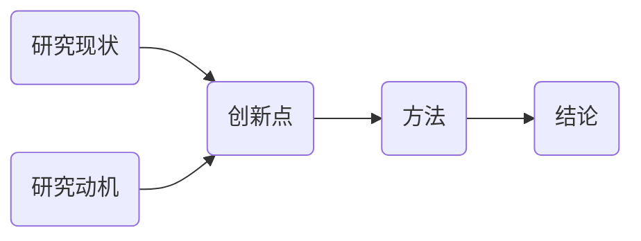
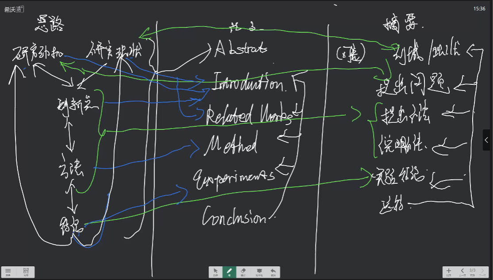

# 第一节课
## 论文的结构
### Title
研究对象&成果（算法/方法/模型/网络/框架） ->（排序算法/目标识别/情感分析） -> 创新点  
**做的什么东西 用来干什么 有什么创新点**
### Abstract(keyword)
#### keyword
快速界定领域、方向
### Introduction
结尾有个固定的本文提出的核心贡献  （产生了什么成果）  你干了什么 别人没敢  解决了什么问题
### Related Work
展开 对应内容   

### Method
理论角度说明干了什么工作
模型结构（输入什么样数据  得到什么样结果）   
无需代码相关

### Experiments
1. 数据集
2. 实现细节（可以写到方法）
3. 展示结果
   1. 已有领域
对比试验  （置信度等指标）   补充试验 消融实验
    2. 

### Result&Discussion
得出主要结论 跟上部分同步进行
### Conclusion
总结  
还有什么局限性
> 英文才要  
还可以往哪扩展
**论文往短了改**

## 论文核心逻辑（写作思路）

     

# 第二节课
现在的ai模型就做两件事（数学意义上）
1. 回归

2. 分类
应用层面就是
1. 输入

2. 输出

- CNN （卷积神经网络）
- GAN （生成对抗网络）
- VAE
- TransFormer   > BERT  ViT  Mamba
  QKV  SoftMax
## 模型
- 

## 框架
