# 机器学习入门代码实践：运行结果

> 本文件由 `uv run ml-practice` 自动生成。生成时间：
> 2026-08-02 22:16:27 中国标准时间。

## 实验目标与流程

我按照第二部分理论报告中的模型顺序组织实验。每组实验都遵循“准备数据 → 划分或预处理
→ 训练模型 → 在未参与训练的数据上评价 → 使用 Matplotlib 保存图片”的流程。经典算法采用
scikit-learn 自带小型数据集或固定随机种子的合成数据，深度学习采用 8×8 手写数字数据集，
因此运行时不需要额外下载数据。

本次运行环境：

- Python：3.12.13
- 操作系统：Windows-11-10.0.22631-SP0
- NumPy：2.5.1
- scikit-learn：1.9.0
- Matplotlib：3.11.1
- PyTorch：2.13.0+cpu
- 深度学习轮数：15

## 实现范围

| 知识库部分 | 模型或方法 | 本工程中的实现 |
|---|---|---|
| Machine Learning 1：Supervised Learning | 线性回归、逻辑回归、决策树、朴素贝叶斯 | 线性/逻辑/高斯朴素贝叶斯使用 NumPy 手写，决策树使用 scikit-learn |
| Machine Learning 2：Advanced / Unsupervised | SVM、随机森林、梯度提升、K-Means、层次聚类、PCA | K-Means/PCA 使用 NumPy 手写，其余使用 scikit-learn / SciPy |
| Machine Learning 3：Optimization & Evaluation | 特征缩放、交叉验证、超参数搜索、统一指标 | `Pipeline`、`StratifiedKFold`、`GridSearchCV` 与多种评价指标 |
| Deep Learning 1/2/3 | MLP、CNN、自注意力 | 使用 PyTorch 搭建并训练；自注意力显式实现缩放点积公式 |

## 结果统计

### 线性回归

| 模型 | mse | rmse | mae | r2 | iterations |
|---|---:|---:|---:|---:|---:|
| Linear Regression (NumPy) | 188.2050 | 13.7188 | 11.1380 | 0.9305 | 85 |

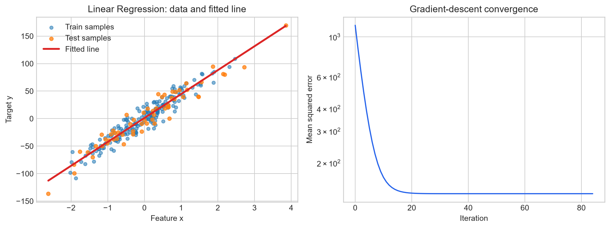

### 监督学习与进阶监督学习

| 模型 | accuracy | precision | recall | f1 | roc_auc |
|---|---:|---:|---:|---:|---:|
| Logistic Regression (NumPy) | 0.9860 | 0.9889 | 0.9889 | 0.9889 | 0.9977 |
| Decision Tree | 0.9301 | 0.9444 | 0.9444 | 0.9444 | 0.9314 |
| Gaussian Naive Bayes (NumPy) | 0.9371 | 0.9263 | 0.9778 | 0.9514 | 0.9893 |
| SVM (RBF kernel) | 0.9860 | 0.9889 | 0.9889 | 0.9889 | 0.9983 |
| Random Forest | 0.9580 | 0.9565 | 0.9778 | 0.9670 | 0.9939 |
| Gradient Boosting | 0.9441 | 0.9457 | 0.9667 | 0.9560 | 0.9931 |

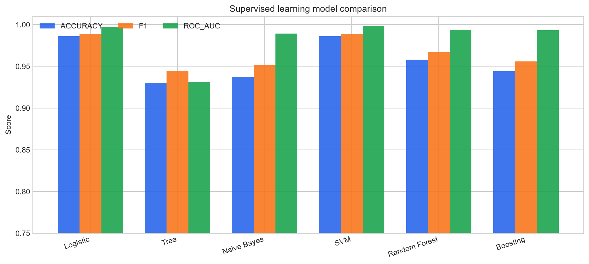

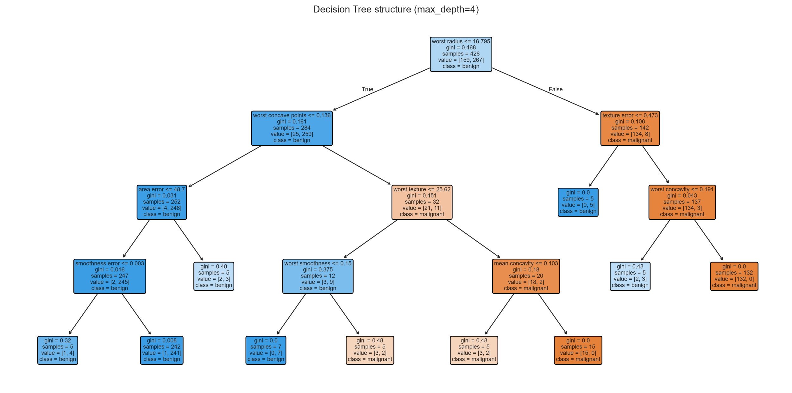

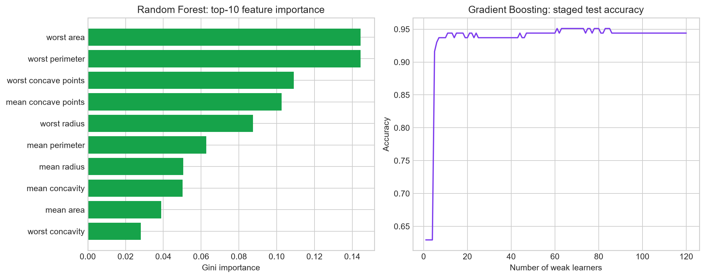

### 优化与评价

| 模型 | fold_f1 | mean_f1 | std_f1 |
|---|---:|---:|---:|
| SVM Cross Validation | 0.9929, 0.9583, 0.9796, 0.9930, 0.9861 | 0.9820 | 0.0128 |

| 模型 | best_cv_f1 | best_C | best_gamma |
|---|---:|---:|---:|
| SVM Grid Search | 0.9861 | 5.0000 | scale |

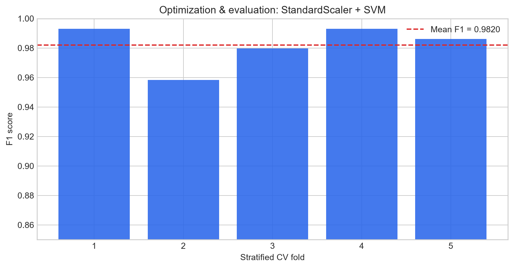

### 无监督学习

| 模型 | silhouette | adjusted_rand_index | inertia | iterations |
|---|---:|---:|---:|---:|
| K-Means (NumPy) | 0.8786 | 1.0000 | 355.9776 | 2 |
| Hierarchical Clustering | 0.8786 | 1.0000 | — | — |

| 模型 | explained_variance_pc1 | explained_variance_pc2 | cumulative_explained_variance | reconstruction_mse |
|---|---:|---:|---:|---:|
| PCA (NumPy) | 0.3620 | 0.1921 | 0.5541 | 0.4459 |

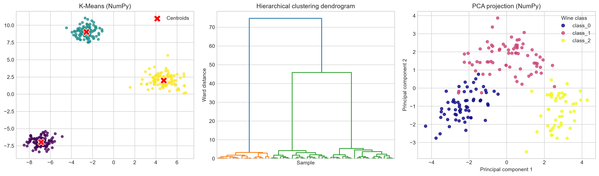

### 深度学习

| 模型 | accuracy | macro_f1 | parameters | epochs | device |
|---|---:|---:|---:|---:|---:|
| MLP | 0.9533 | 0.9532 | 17226 | 15 | cpu |
| CNN | 0.9556 | 0.9547 | 13706 | 15 | cpu |
| Self-Attention | 0.9822 | 0.9821 | 26186 | 15 | cpu |

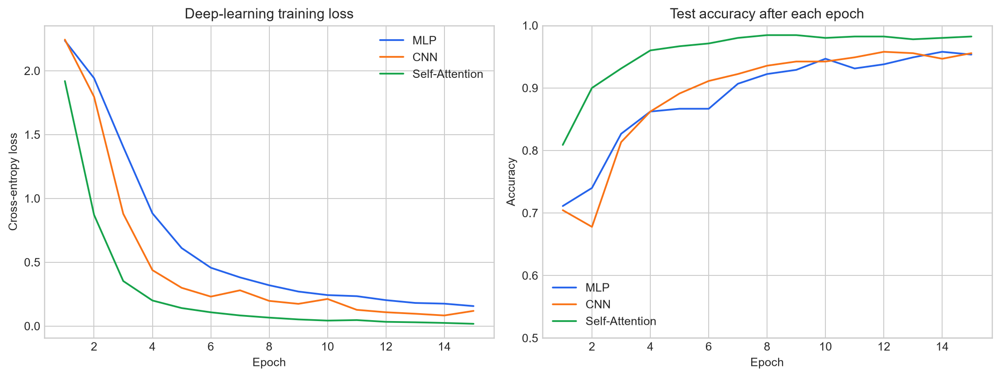

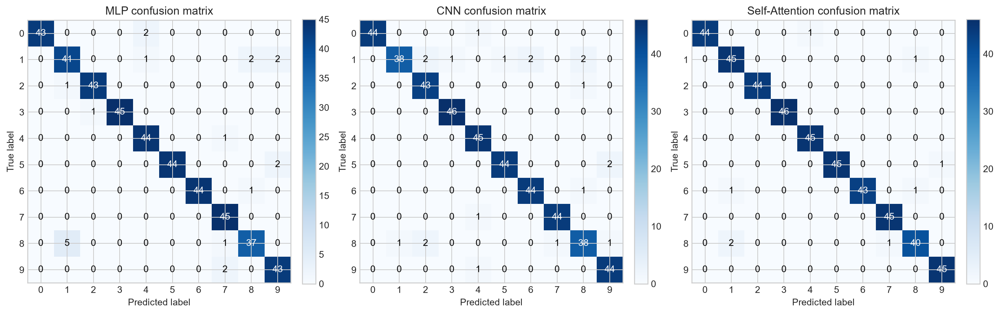

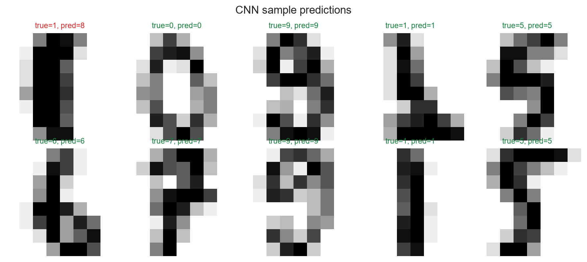

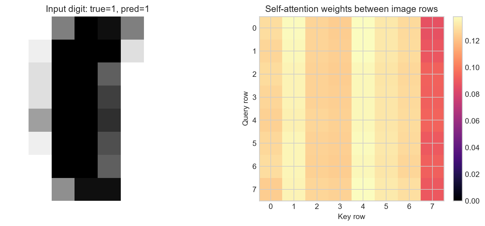

### 总览

不同任务的指标含义不同，因此总览图分面展示回归 R²、传统分类 F1、聚类轮廓系数和
深度学习准确率，不把它们错误地合并成同一排名。

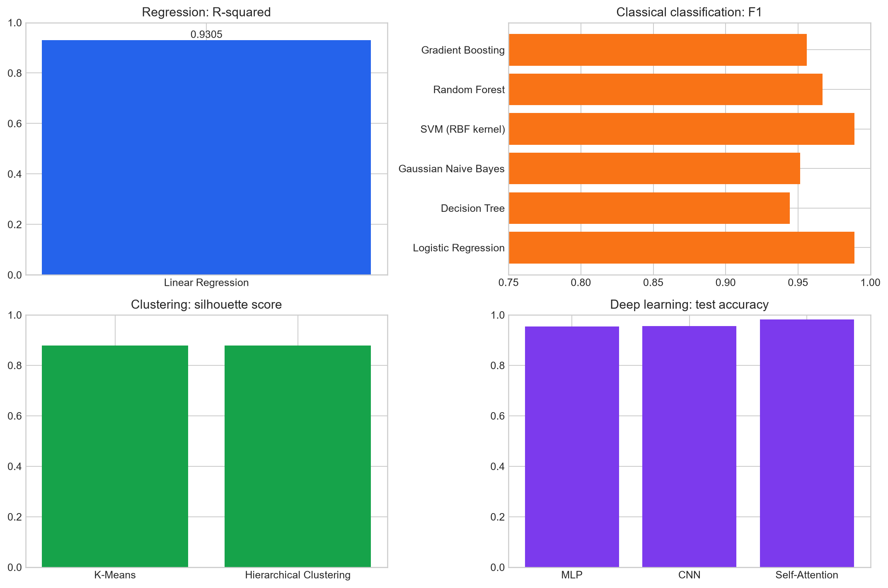

## 结果分析

- 线性回归的测试集 R² 为 0.9305，
  同时损失曲线逐步下降，说明梯度下降在当前学习率下已经收敛。
- 六个传统分类模型中，`Logistic Regression (NumPy)` 的 F1 最高，为
  0.9889。单次划分结果不等同于模型的一般排名，
  因此工程又使用分层五折交叉验证报告均值和波动。
- K-Means 与层次聚类的轮廓系数分别为
  0.8786 和
  0.8786；树状图额外保留了样本合并层次。
- PCA 的前两个主成分累计解释方差比例为
  0.5541。二维图便于观察结构，
  但降维也会损失一部分信息，重建误差对此进行了量化。
- 三个深度学习模型中，当前设置下 `Self-Attention` 的测试准确率最高，为 0.9822。

## 可复现性说明

所有随机过程都使用固定种子 42。`metrics.json` 保存结构化结果，`metrics.csv` 便于在表格软件
中继续分析；重新执行完整命令会更新本文件和全部图片。
